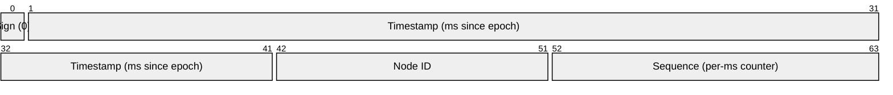
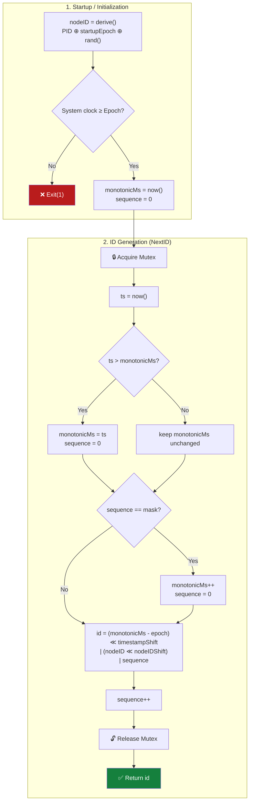
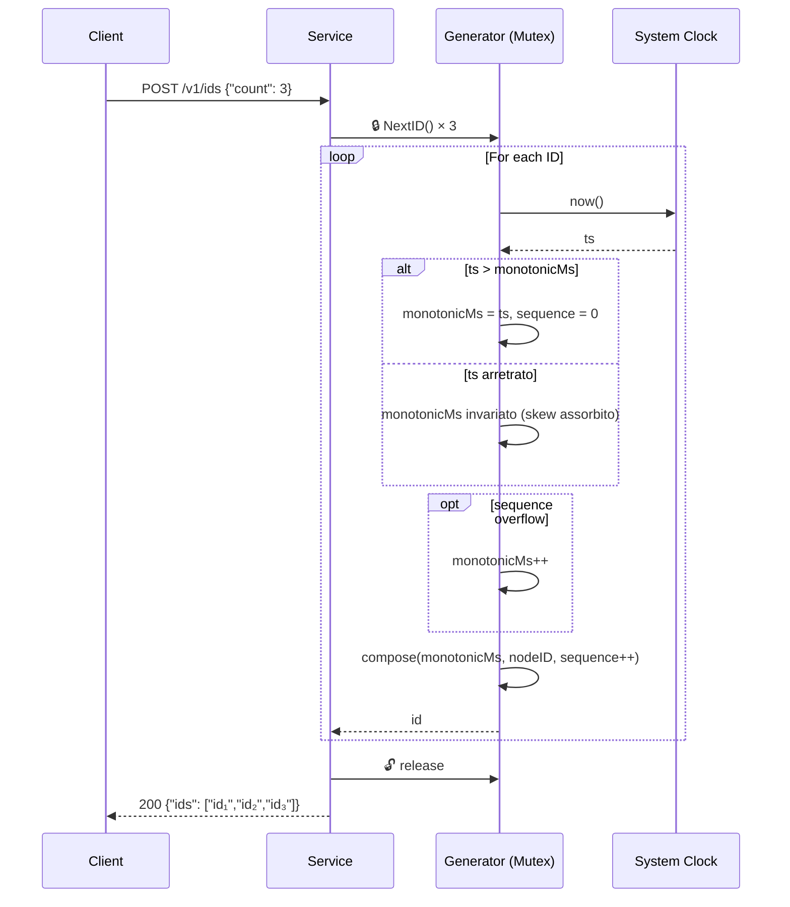
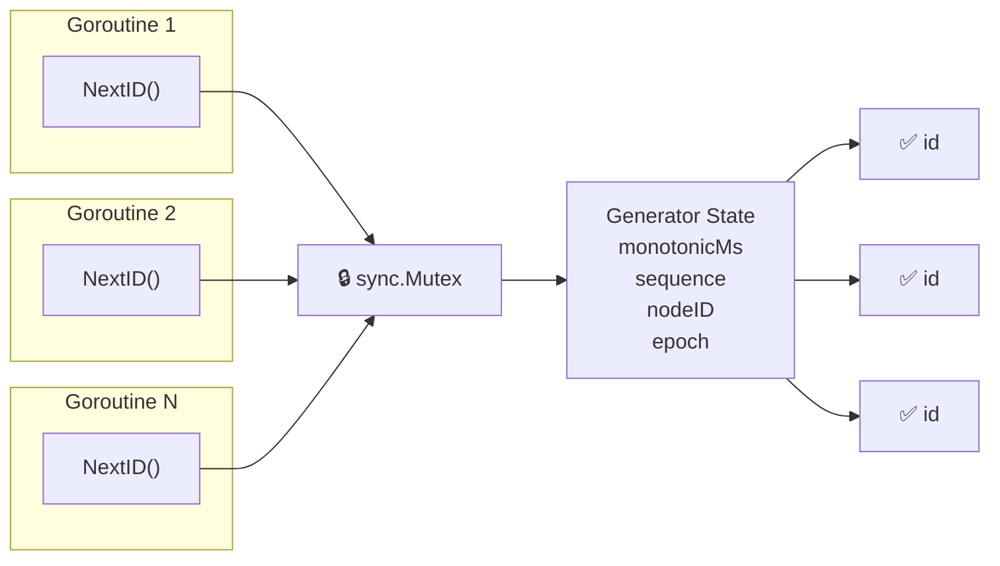
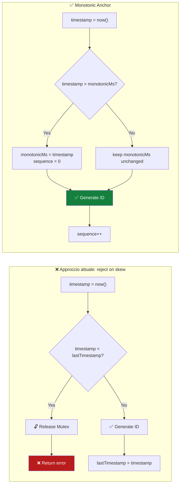

# Snowflake ID — Algorithm Workflow

## Bit Layout


_Example layout: 1+41+10+12 bits, fully configurable._

---

## Startup & Generation Flow _(monotonic anchor + ephemeral node ID)_



_Nota: nessun percorso di errore per clock skew. Il node ID è effimero (cambia a ogni restart), eliminando la necessità di persistenza._

## Sequence Diagram _(monotonic anchor)_



## Concurrency Model



---

## Modernization Analysis

Alla luce delle ricerche condotte (Twitter Snowflake, Discord, Instagram, ULID, KSUID, XID, Sonyflake, UUIDv7/RFC 9562), emergono chiare direttrici di miglioramento dell'algoritmo originale (2010). Di seguito un'analisi ragionata, ordinata per impatto/rischio.

### 1. Clock Skew: da "reject" a "monotonic anchor"

**Problema attuale:** se il system clock torna indietro (NTP correction, VM migration, leap second), il generatore restituisce errore. Il chiamante deve gestire il fallimento a cascata.

**Fonti:** Twitter reference impl lancia eccezione; Segment (KSUID) e RFC 9562 (UUIDv7) lo considerano il difetto principale di Snowflake; Sonyflake eredita lo stesso problema.

**Miglioramento:** sostituire `lastTimestamp` con un **contatore monotono interno** (`monotonicMs`).

#### Prima e dopo a confronto



#### Pseudocodice Go (prima e dopo)

**Prima (reject):**
```go
timestamp := nowMs()
if timestamp < g.lastTimestamp {
    return 0, ErrClockSkew
}
if timestamp == g.lastTimestamp {
    g.sequence = (g.sequence + 1) & sequenceMask
    if g.sequence == 0 {
        timestamp = tilNextMillis(g.lastTimestamp)
    }
} else {
    g.sequence = 0
}
g.lastTimestamp = timestamp
return compose(timestamp, g.nodeID, g.sequence), nil
```

**Dopo (monotonic anchor):**
```go
ts := nowMs()
if ts > g.monotonicMs {
    g.monotonicMs = ts
    g.sequence = 0
} // else: ts è arretrato → monotonicMs NON cambia
if g.sequence == sequenceMask {
    g.monotonicMs++ // avanza forzatamente se sequence satura
    g.sequence = 0
}
id := compose(g.monotonicMs, g.nodeID, g.sequence)
g.sequence++
return id, nil
```
_Nota: `NextID()` non restituisce mai errore per clock skew._

#### Analisi del cambiamento

Il monotonicMs **disaccoppia** l'avanzamento del timestamp dal clock di sistema:

| Scenario | `now()` | `monotonicMs` prima | Azione | `monotonicMs` dopo |
|---|---|---|---|---|
| Normale | 5000 | 4999 | `now() > monotonicMs` → aggiorna | 5000 |
| Stesso ms | 5000 | 5000 | `now() == monotonicMs` → solo sequence++ | 5000 |
| **Clock skew** | **4995** | 5000 | `now() ≤ monotonicMs` → **ignora skew** | **5000** |
| Sequence overflow | 5000 | 5000 | `sequence == mask` → `monotonicMs++` | 5001 |

**Cosa succede durante uno skew:**
1. Il clock di sistema va da 5000 a 4995 (skew di -5ms)
2. `monotonicMs` **rimane a 5000** — non torna mai indietro
3. La sequence continua a incrementare normalmente
4. Quando il clock recupera (es. 5010), `monotonicMs` riprende a seguirlo

**Implicazioni:**
- **Zero errori** → nessun 503, nessun fallimento a cascata
- **Timestamp "vecchio" negli ID** durante lo skew → gli ID restano ordinabili ma con timestamp leggermente sfalsato rispetto al wall clock. In uno skew di 5ms, l'errore è trascurabile.
- **La sequence deve assorbire lo skew** → con 12 bit (4096 ID/ms), uno skew di 1 secondo richiede ~4M ID per essere assorbito senza overflow. Se il throughput reale è 1000 ID/s, 12 bit bastano per ~4 secondi di skew.
- **Se la sequence si satura durante lo skew:** `monotonicMs++` forza l'avanzamento. Questo "consuma" timestamp futuri, ma è un evento raro e comunque garantisce unicità.

#### Inizializzazione e persistenza

**Domanda critica:** all'avvio, a che valore si inizializza `monotonicMs`?

```go
func NewGenerator(nodeID int64, epoch int64) *Generator {
    return &Generator{
        nodeID:      nodeID,
        epoch:       epoch,
        monotonicMs: nowMs(), // ← inizializzato al clock corrente
        sequence:    0,
    }
}
```

All'avvio, `monotonicMs = nowMs()`. Questo funziona perché il processo non ha ancora generato ID, quindi non c'è un passato da proteggere. Il monotonic anchor garantisce che **durante la vita del processo**, il timestamp non torni mai indietro.

**Cosa succede dopo un restart?** È qui che il monotonic anchor da solo non basta:

```
Prima del restart: ultimo ID → monotonicMs=5000, node=5, sequence=100
... SERVICE RESTART ...
Dopo il restart:    monotonicMs = now() = 4990  ← clock arretrato rispetto a prima!
                    Primo ID → monotonicMs=4990, node=5, sequence=0
                    ⚠ Collisione possibile con ID generati prima del restart!
```

Tre modi per risolvere, in ordine di complessità crescente:

| Strategia | Come funziona | Pro | Contro |
|---|---|---|---|
| **Node ID effimero** | A ogni restart, il node ID cambia (es. PID + timestamp di avvio). L'ID pre-restart ha node=5, post-restart ha node=23. Nessuna collisione possibile. | Zero I/O, zero stato | Consuma node ID; K8s ordinals vanno mappati diversamente |
| **Persistenza su file** | Prima dello shutdown, scrivi `monotonicMs` su file. All'avvio: `monotonicMs = max(now(), fileValue + 1)`. | Risolve completamente | Richiede graceful shutdown; file system dipendency; il file può corrompersi |
| **K8s StatefulSet + PVC** | Il `monotonicMs` viene scritto su un PersistentVolume legato al pod. Al restart sullo stesso ordinal, il valore viene recuperato. | Robusto, nativo K8s | Complessità operativa |

**Confronto con l'algoritmo originale:**

L'algoritmo originale ha lo **stesso identico problema**, solo nascosto:

```go
// Originale: lastTimestamp inizializzato a 0
lastTimestamp := int64(0)
// Primo NextID(): now() >= 0 → sempre true, nessun controllo di skew
timestamp := nowMs() // usa 4990, ignora che prima del restart era 5000
```

La differenza è che l'originale **non rileva** il clock skew cross-restart perché `lastTimestamp = 0` è sempre ≤ `now()`. Il monotonic anchor rende il problema **esplicito** e fornisce un meccanismo per risolverlo (persistenza su file). Ma per il caso d'uso a basso volume con K8s, la strategia più pragmatica è **node ID effimero**: non richiede persistenza, è a prova di restart non graceful, e sfrutta il fatto che abbiamo più bit di node ID di quanti ne servano realmente.


### 2. Sequence: introdurre bit di randomness

**Problema attuale:** 12 bit di sequence = 4096 ID/ms. Carichi burst possono saturare e causare spin-wait (consumo CPU). Inoltre la sequence puramente incrementale rende gli ID **prevedibili** — un avversario può stimare il prossimo ID.

**Fonti:** KSUID usa 128 bit di payload casuale; ULID usa 80 bit casuali; UUIDv7 usa 74 bit casuali; XID inizializza il counter con un valore random.

**Miglioramento:** invece di una sequence puramente incrementale, usare un **contatore ibrido**: i bit bassi sono incrementali, i bit alti sono inizializzati con un valore random all'avvio (o a ogni nuovo millisecondo). Questo:
- Mantiene l'ordinamento (i bit incrementali nei bit meno significativi)
- Rende gli ID non prevedibili
- Mitiga il rischio di collisione in caso di clock skew (randomness ≠ overlap deterministico)

### 3. Node ID: derivazione automatica invece di configurazione manuale

**Problema attuale:** ogni istanza richiede un node ID univoco a 10 bit (1024 max). Assegnazione manuale non scala; Zookeeper aggiunge complessità; StatefulSet ordinal funziona solo su K8s.

**Fonti:** XID deriva il machine ID dall'hostname (3 byte); Sonyflake usa i 16 bit bassi dell'IP privato; ULID/KSUID/UUIDv7 eliminano completamente il node ID.

**Miglioramento:** derivare automaticamente il node ID da caratteristiche locali dell'host, con fallback a random:
1. Se su K8s: `POD_ORDINAL` o hash del `POD_NAME`
2. Altrimenti: hash dei primi 16 bit dell'IP privato (come Sonyflake) o hash dell'hostname
3. Fallback: random (con persistenza su file per sopravvivere ai restart sullo stesso host)

Questo elimina la configurazione manuale nella maggior parte dei casi senza richiedere Zookeeper.

### 4. Eliminare il Mutex: generator lock-free

**Problema attuale:** `sync.Mutex` serializza tutte le chiamate a `NextID()`. Sotto carico concorrente, le goroutine fanno coda sul mutex.

**Fonti:** XID è lock-free (usa counter atomici e machine ID precalcolato); il benchmark XID mostra 32 ns/op vs UUIDv1 che degrada con più CPU a causa del lock globale.

**Miglioramento:** usare `atomic` per la sequence e timestamp:
- `lastTimestamp` e `sequence` diventano un singolo `uint64` gestito con `atomic.CompareAndSwap`
- Se il CAS fallisce (conflitto con altra goroutine), retry immediato (spin locale, non sul mutex)
- Questo riduce la contesa e scala linearmente col numero di core

**Caveat:** il lock-free è più complesso da testare e verificare. Il mutex rimane accettabile per volumi bassi.

### 5. Espandere il bit budget

**Problema attuale:** 64 bit sono un formato chiuso. Non si possono aggiungere bit per funzionalità future senza rompere la compatibilità.

**Fonti:** il trend 2017-2024 è verso ID più grandi: XID 96 bit, ULID 128 bit, KSUID 160 bit, UUIDv7 128 bit. Il trade-off dimensionale è quasi sempre favorevole ai bit extra.

**Miglioramento:** considerare **almeno 96 bit** (12 byte, come XID e MongoDB ObjectID):
- 1 bit sign + 47 bit timestamp ms (8920 anni di autonomia)
- 24 bit node ID (16.7M istanze, derivazione automatica sicura)
- 24 bit randomness + sequence ibrida

Oppure **128 bit** (16 byte, come UUIDv7/ULID):
- 48 bit timestamp Unix ms (standard IETF, 8900 anni)
- 80 bit payload casuale — **elimina completamente** node ID, clock skew e sequence overflow
- Zero configurazione, zero coordinamento, zero policy di clock skew

### 6. Epoch standard

**Problema attuale:** ogni implementazione Snowflake usa un epoch custom (Twitter: `1288834974657`, Discord: `1420070400000`). L'ID non è interpretabile senza conoscere l'epoch.

**Miglioramento:** adottare **Unix epoch in millisecondi** (come UUIDv7 e ULID). Perdita: il timestamp parte da 1970 invece che da una data recente. Guadagno: ogni ID è auto-descrittivo e interoperabile.

### Raccomandazione per la modernizzazione

**Fase 1 (basso rischio, alto impatto):**
1. Monotonic anchor per clock skew → elimina la classe di errore più frequente in produzione
2. Sequence ibrida (random-init) → non-predictable + più robusto

**Fase 2 (medio impatto, richiede pianificazione):**
3. Node ID auto-derivato → elimina configurazione manuale
4. Lock-free via atomic → scala con più core

**Fase 3 (alto impatto, richiede decisione architetturale):**
5. Espansione a 96 o 128 bit → risolve alla radice tutti i problemi di Snowflake (node ID, clock skew, sequence overflow, prevedibilità)
6. Epoch standard → interoperabilità nativa con UUIDv7

Il salto a 128 bit con payload casuale (stile UUIDv7) rappresenta la **convergenza finale** di tutti i sistemi moderni analizzati: il costo in storage (16 vs 8 byte) è trascurabile per la maggior parte dei casi d'uso, e il guadagno in robustezza è definitivo.
