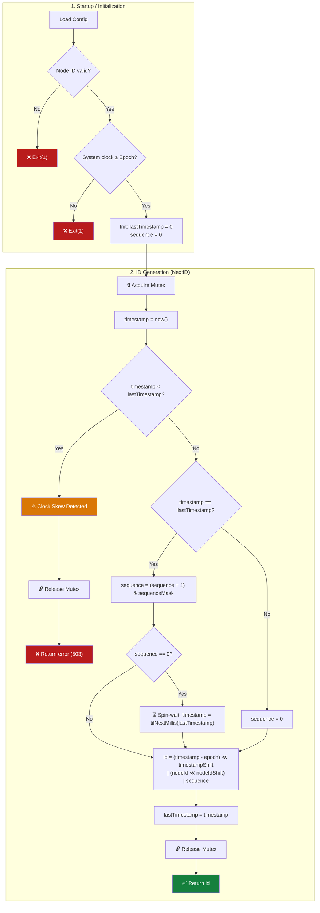
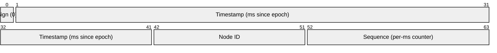
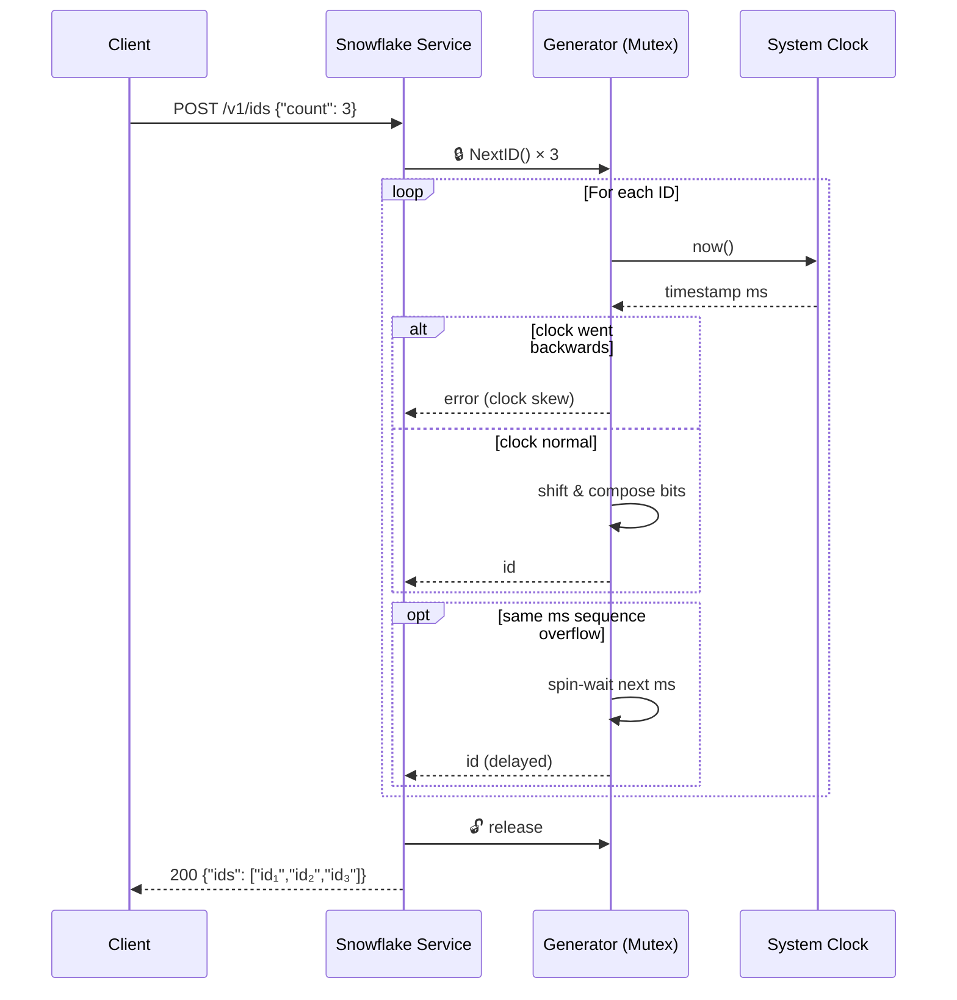
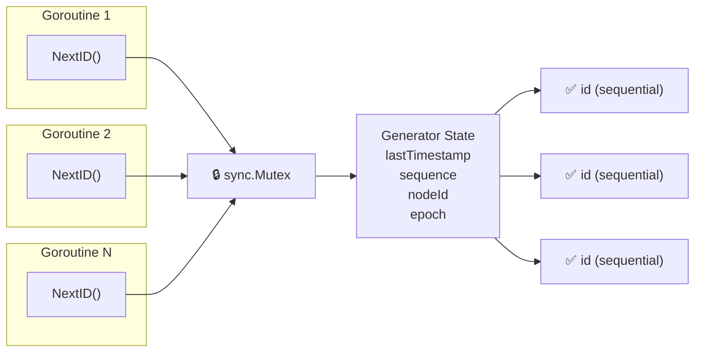

# Snowflake ID — Algorithm Workflow

```mermaid
flowchart TD
    subgraph INIT["1. Startup / Initialization"]
        A["Load Config"]
        A --> B{"Node ID valid?"}
        B -->|No| C["❌ Exit(1)"]
        B -->|Yes| D{"System clock ≥ Epoch?"}
        D -->|No| E["❌ Exit(1)"]
        D -->|Yes| F["Init: lastTimestamp = 0<br>sequence = 0"]
    end

    F --> G

    subgraph GEN["2. ID Generation (NextID)"]
        G["🔒 Acquire Mutex"]
        G --> H["timestamp = now()"]

        H --> I{"timestamp < lastTimestamp?"}
        I -->|Yes| J["⚠ Clock Skew Detected"]
        J --> K["🔓 Release Mutex"]
        K --> L["❌ Return error (503)"]

        I -->|No| M{"timestamp == lastTimestamp?"}
        M -->|Yes| N["sequence = (sequence + 1) & sequenceMask"]
        N --> O{"sequence == 0?"}
        O -->|Yes| P["⏳ Spin-wait: timestamp = tilNextMillis(lastTimestamp)"]
        O -->|No| Q["Build ID"]
        P --> Q

        M -->|No| R["sequence = 0"]
        R --> Q

        Q["id = (timestamp - epoch) ≪ timestampShift<br>| (nodeId ≪ nodeIdShift)<br>| sequence"]

        Q --> S["lastTimestamp = timestamp"]
        S --> T["🔓 Release Mutex"]
        T --> U["✅ Return id"]
    end

    style C fill:#b91c1c,color:#fff
    style E fill:#b91c1c,color:#fff
    style J fill:#d97706,color:#fff
    style L fill:#b91c1c,color:#fff
    style U fill:#15803d,color:#fff
```

## Bit Layout

```mermaid
packet-beta
0: "Sign (0)"
1-41: "Timestamp (ms since epoch)"
42-51: "Node ID"
52-63: "Sequence (per-ms counter)"
```
_Example layout: 1+41+10+12 bits, fully configurable._

## Sequence Diagram

```mermaid
sequenceDiagram
    participant C as Client
    participant S as Snowflake Service
    participant G as Generator (Mutex)
    participant Ck as System Clock

    C->>S: POST /v1/ids {"count": 3}
    S->>G: 🔒 NextID() × 3

    loop For each ID
        G->>Ck: now()
        Ck-->>G: timestamp ms
        alt clock went backwards
            G-->>S: error (clock skew)
        else clock normal
            G->>G: shift & compose bits
            G-->>S: id
        end
        opt same ms sequence overflow
            G->>G: spin-wait next ms
            G-->>S: id (delayed)
        end
    end

    S->>G: 🔓 release
    S-->>C: 200 {"ids": ["id₁","id₂","id₃"]}
```

## Concurrency Model

```mermaid
flowchart LR
    subgraph "Goroutine 1"
        G1["NextID()"]
    end
    subgraph "Goroutine 2"
        G2["NextID()"]
    end
    subgraph "Goroutine N"
        GN["NextID()"]
    end

    G1 --> M["🔒 sync.Mutex"]
    G2 --> M
    GN --> M
    M --> Gen["Generator State<br>lastTimestamp<br>sequence<br>nodeId<br>epoch"]
    Gen --> ID1["✅ id (sequential)"]
    Gen --> ID2["✅ id (sequential)"]
    Gen --> IDN["✅ id (sequential)"]
```
