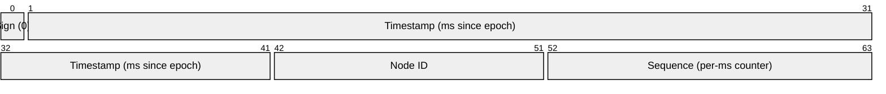
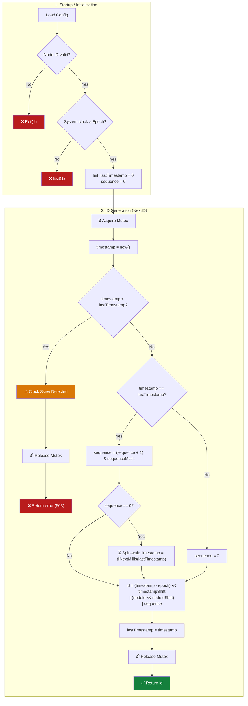
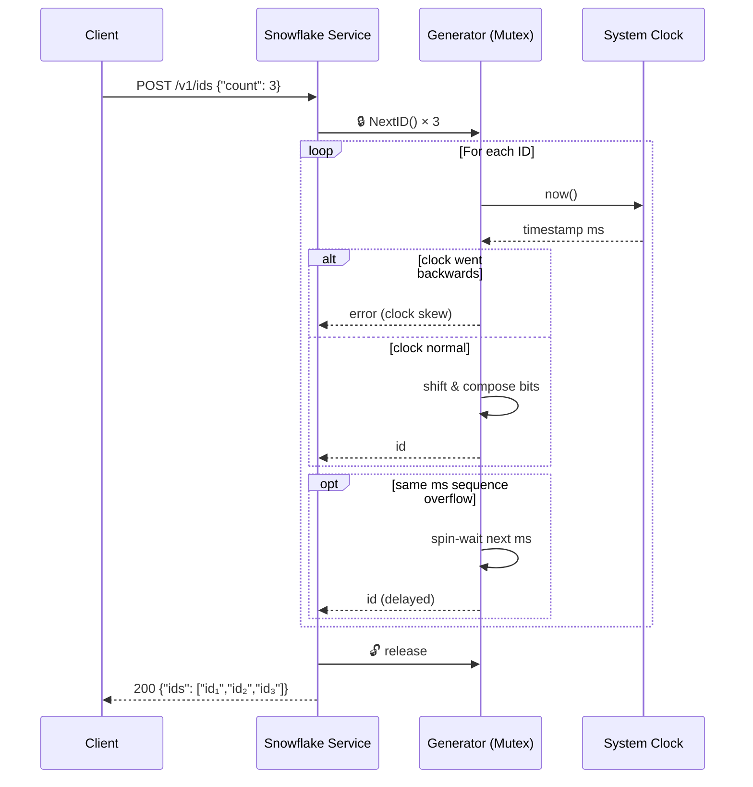
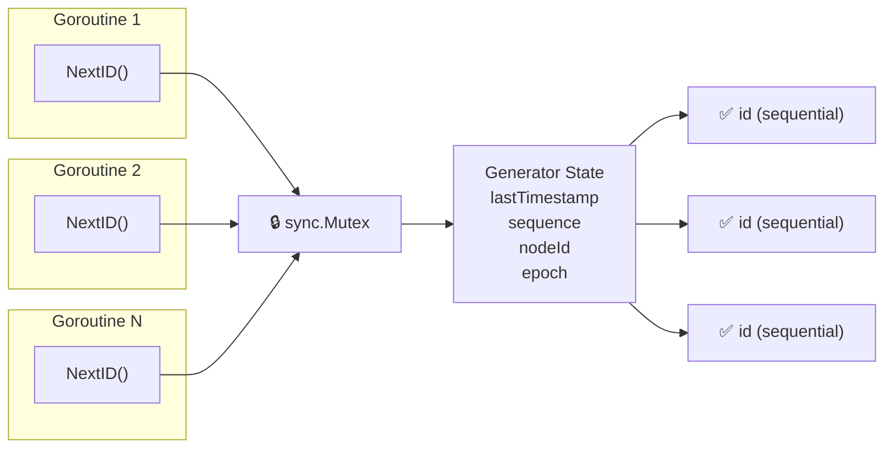

# Snowflake ID — Algorithm Workflow

## Bit Layout

_Example layout: 1+41+10+12 bits, fully configurable._

---

## Startup & Generation Flow

## Sequence Diagram

## Concurrency Model

---

## Modernization Analysis

Alla luce delle ricerche condotte (Twitter Snowflake, Discord, Instagram, ULID, KSUID, XID, Sonyflake, UUIDv7/RFC 9562), emergono chiare direttrici di miglioramento dell'algoritmo originale (2010). Di seguito un'analisi ragionata, ordinata per impatto/rischio.

### 1. Clock Skew: da "reject" a "monotonic anchor"

**Problema attuale:** se il system clock torna indietro (NTP correction, VM migration, leap second), il generatore restituisce errore. Il chiamante deve gestire il fallimento a cascata.

**Fonti:** Twitter reference impl lancia eccezione; Segment (KSUID) e RFC 9562 (UUIDv7) lo considerano il difetto principale di Snowflake; Sonyflake eredita lo stesso problema.

**Miglioramento:** sostituire `lastTimestamp` con un **contatore monotono interno** (`monotonicMs`) che:
- Si aggiorna da `now()` solo se `now() > monotonicMs`
- Se `now() < monotonicMs` (clock skew), continua a usare `monotonicMs` invariato, incrementando solo la sequence
- La sequence, in questo modello, deve avere **bit sufficienti** a coprire la durata massima attesa di uno skew (es. se lo skew tipico è < 5 secondi, 12 bit bastano per ~4 secondi a 4096 ID/ms; 14 bit coprono ~16 secondi)

**Trade-off:** gli ID generati durante uno skew avranno timestamp "vecchio", ma restano unici e ordinabili. Nessun errore, nessun outage.

### 2. Sequence: introdurre bit di randomness

**Problema attuale:** 12 bit di sequence = 4096 ID/ms. Carichi burst possono saturare e causare spin-wait (consumo CPU). Inoltre la sequence puramente incrementale rende gli ID **prevedibili** — un avversario può stimare il prossimo ID.

**Fonti:** KSUID usa 128 bit di payload casuale; ULID usa 80 bit casuali; UUIDv7 usa 74 bit casuali; XID inizializza il counter con un valore random.

**Miglioramento:** invece di una sequence puramente incrementale, usare un **contatore ibrido**: i bit bassi sono incrementali, i bit alti sono inizializzati con un valore random all'avvio (o a ogni nuovo millisecondo). Questo:
- Mantiene l'ordinamento (i bit incrementali nei bit meno significativi)
- Rende gli ID non prevedibili
- Mitiga il rischio di collisione in caso di clock skew (randomness ≠ overlap deterministico)

### 3. Node ID: derivazione automatica invece di configurazione manuale

**Problema attuale:** ogni istanza richiede un node ID univoco a 10 bit (1024 max). Assegnazione manuale non scala; Zookeeper aggiunge complessità; StatefulSet ordinal funziona solo su K8s.

**Fonti:** XID deriva il machine ID dall'hostname (3 byte); Sonyflake usa i 16 bit bassi dell'IP privato; ULID/KSUID/UUIDv7 eliminano completamente il node ID.

**Miglioramento:** derivare automaticamente il node ID da caratteristiche locali dell'host, con fallback a random:
1. Se su K8s: `POD_ORDINAL` o hash del `POD_NAME`
2. Altrimenti: hash dei primi 16 bit dell'IP privato (come Sonyflake) o hash dell'hostname
3. Fallback: random (con persistenza su file per sopravvivere ai restart sullo stesso host)

Questo elimina la configurazione manuale nella maggior parte dei casi senza richiedere Zookeeper.

### 4. Eliminare il Mutex: generator lock-free

**Problema attuale:** `sync.Mutex` serializza tutte le chiamate a `NextID()`. Sotto carico concorrente, le goroutine fanno coda sul mutex.

**Fonti:** XID è lock-free (usa counter atomici e machine ID precalcolato); il benchmark XID mostra 32 ns/op vs UUIDv1 che degrada con più CPU a causa del lock globale.

**Miglioramento:** usare `atomic` per la sequence e timestamp:
- `lastTimestamp` e `sequence` diventano un singolo `uint64` gestito con `atomic.CompareAndSwap`
- Se il CAS fallisce (conflitto con altra goroutine), retry immediato (spin locale, non sul mutex)
- Questo riduce la contesa e scala linearmente col numero di core

**Caveat:** il lock-free è più complesso da testare e verificare. Il mutex rimane accettabile per volumi bassi.

### 5. Espandere il bit budget

**Problema attuale:** 64 bit sono un formato chiuso. Non si possono aggiungere bit per funzionalità future senza rompere la compatibilità.

**Fonti:** il trend 2017-2024 è verso ID più grandi: XID 96 bit, ULID 128 bit, KSUID 160 bit, UUIDv7 128 bit. Il trade-off dimensionale è quasi sempre favorevole ai bit extra.

**Miglioramento:** considerare **almeno 96 bit** (12 byte, come XID e MongoDB ObjectID):
- 1 bit sign + 47 bit timestamp ms (8920 anni di autonomia)
- 24 bit node ID (16.7M istanze, derivazione automatica sicura)
- 24 bit randomness + sequence ibrida

Oppure **128 bit** (16 byte, come UUIDv7/ULID):
- 48 bit timestamp Unix ms (standard IETF, 8900 anni)
- 80 bit payload casuale — **elimina completamente** node ID, clock skew e sequence overflow
- Zero configurazione, zero coordinamento, zero policy di clock skew

### 6. Epoch standard

**Problema attuale:** ogni implementazione Snowflake usa un epoch custom (Twitter: `1288834974657`, Discord: `1420070400000`). L'ID non è interpretabile senza conoscere l'epoch.

**Miglioramento:** adottare **Unix epoch in millisecondi** (come UUIDv7 e ULID). Perdita: il timestamp parte da 1970 invece che da una data recente. Guadagno: ogni ID è auto-descrittivo e interoperabile.

### Raccomandazione per la modernizzazione

**Fase 1 (basso rischio, alto impatto):**
1. Monotonic anchor per clock skew → elimina la classe di errore più frequente in produzione
2. Sequence ibrida (random-init) → non-predictable + più robusto

**Fase 2 (medio impatto, richiede pianificazione):**
3. Node ID auto-derivato → elimina configurazione manuale
4. Lock-free via atomic → scala con più core

**Fase 3 (alto impatto, richiede decisione architetturale):**
5. Espansione a 96 o 128 bit → risolve alla radice tutti i problemi di Snowflake (node ID, clock skew, sequence overflow, prevedibilità)
6. Epoch standard → interoperabilità nativa con UUIDv7

Il salto a 128 bit con payload casuale (stile UUIDv7) rappresenta la **convergenza finale** di tutti i sistemi moderni analizzati: il costo in storage (16 vs 8 byte) è trascurabile per la maggior parte dei casi d'uso, e il guadagno in robustezza è definitivo.
