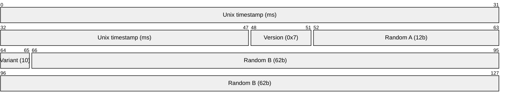
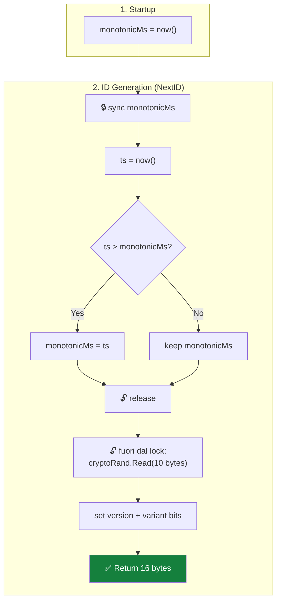
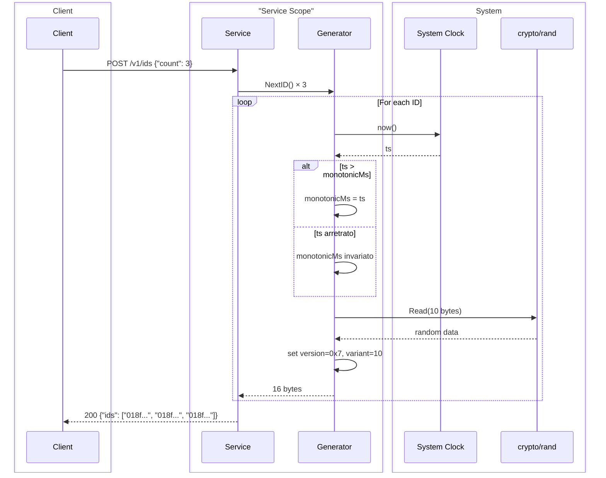
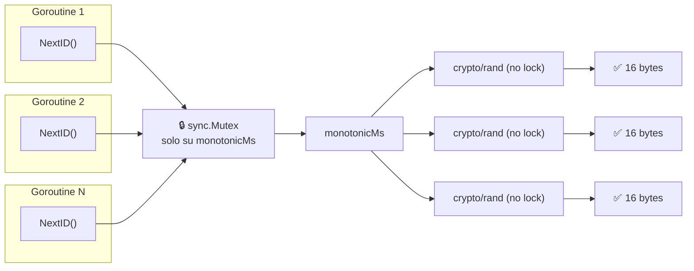

# Snowflake ID — Algorithm Workflow (128 bit)

> **Decisione:** [MADR 0003](../madr/0003-128-bit-random-payload.md) — 128 bit con payload casuale, stile UUIDv7.
> I miglioramenti #1-#4 (monotonic anchor, hybrid sequence, node ID derivation, lock-free) sono assorbiti dal design a 128 bit e non più necessari.

## Bit Layout


_48 bit timestamp Unix ms + 4 bit version + 2 bit variant + 74 bit random = 128 bit. Conforme a RFC 9562 UUIDv7._

## Startup & Generation Flow



## Sequence Diagram



## Concurrency Model


_Il mutex protegge solo l'avanzamento di `monotonicMs`. La generazione random (la parte costosa) avviene fuori dal lock, in parallelo._

## Pseudocodice

```go
type Generator struct {
    mu          sync.Mutex
    monotonicMs int64
}

func NewGenerator() *Generator {
    return &Generator{monotonicMs: nowMs()}
}

func (g *Generator) NextID() ([]byte, error) {
    ts := nowMs()
    g.mu.Lock()
    if ts > g.monotonicMs {
        g.monotonicMs = ts
    }
    ts = g.monotonicMs
    g.mu.Unlock()

    var id [16]byte
    binary.BigEndian.PutUint48(id[0:6], uint64(ts))
    cryptoRand.Read(id[6:16])
    id[6] = (id[6] & 0x0F) | 0x70  // version 7
    id[8] = (id[8] & 0x3F) | 0x80  // variant 10xx
    return id[:], nil
}
```

## Cosa NON serve più

| Meccanismo (necessario a 64 bit) | Perché non serve a 128 bit |
|---|---|
| **Node ID** | 74 bit random garantiscono unicità senza identificare la macchina |
| **Sequence + overflow** | Infiniti ID per ms (2^74 spazio casuale) |
| **Clock skew policy** | Anche col clock che torna indietro, random rende il duplicato impossibile |
| **Persistenza cross-restart** | Random diverso a ogni restart, collisione ~impossibile |
| **Spin-wait** | Non esiste più il concetto di "sequence esaurita" |
| **Configurazione manuale** | Zero env, zero file, zero Zookeeper |
| **Epoch custom** | Unix epoch standard, ID auto-descrittivo |

## Serializzazione

Gli ID a 128 bit sono binari (16 byte). Per la risposta JSON, due opzioni:

| Formato | Esempio | Dimensione |
|---|---|---|
| **Hex canonico** (UUID standard) | `018f3a2c-9e5b-7000-8000-123456789abc` | 36 caratteri |
| **Base62** (KSUID-style) | `0ujsswThIGTUYm2K8FjOOfXtY1K` | 22 caratteri |
| **Base64 URL-safe** | `AY86LJ5bcACAAAAAABI0VniavA` | 22 caratteri |

Raccomandato: **hex canonico** per interoperabilità con UUIDv7. Se la compattezza è critica, Base62.
