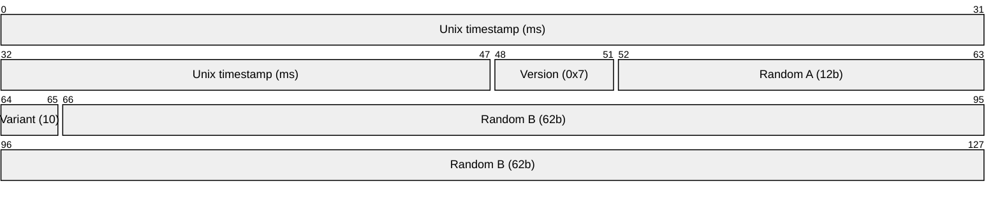
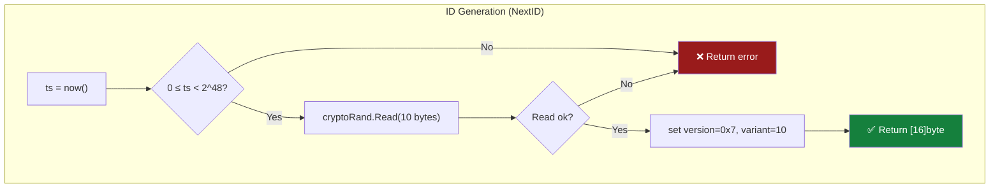
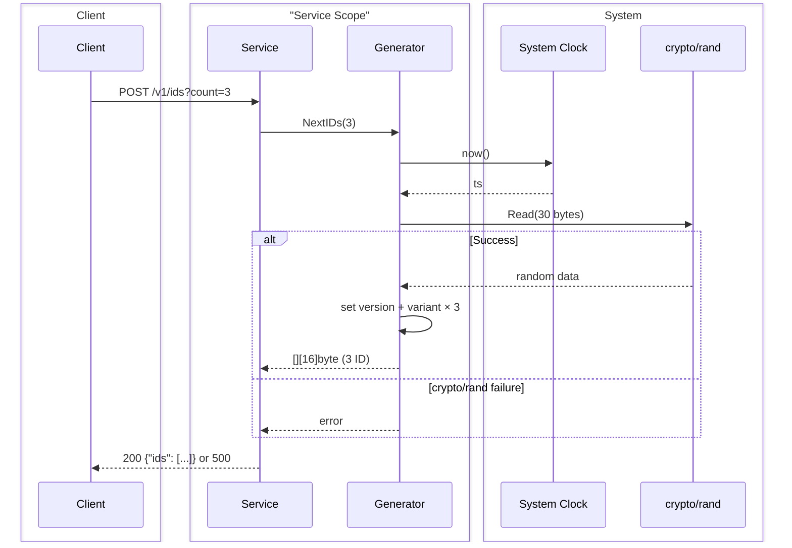
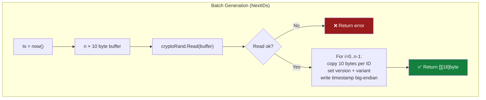

# UUIDv7 Generator — Algorithm Workflow (128 bit)

> **Decisione:** [MADR 0003](../madr/0003-128-bit-random-payload.md) — 128 bit con payload casuale, stile UUIDv7.
> **Modello:** UUIDv7 stateless — nessuno stato condiviso, nessun lock, nessuna persistenza.

## Contratto di ordinamento

Questo generatore produce UUIDv7 a 128 bit conformi a RFC 9562. Il timestamp a 48 bit incorporato segue il wall clock (Unix epoch, millisecondi). L'ordinamento è **approssimativo**:

- ID con timestamp diverso sono ordinabili (il timestamp è nei primi 48 bit in big-endian).
- ID generati nello stesso millisecondo **non hanno ordine garantito** — i 74 bit casuali non sono monotoni.
- Tra più istanze (pod Kubernetes) non c'è coordinamento: ID dello stesso ms non sono ordinabili tra istanze.

Per ordinamento deterministico, usare un campo `created_at` separato.

## Bit Layout


_48 bit Unix timestamp ms + 4 bit version + 2 bit variant + 74 bit random = 128 bit. Conforme a RFC 9562 UUIDv7._

## Startup & Generation Flow



_Il generatore non ha stato: ogni chiamata legge il wall clock e genera 10 byte random. Nessun lock, nessun anchor, nessuna sezione critica._

## Sequence Diagram



## Batch Path



_Il path batch acquisisce il timestamp una sola volta e fa una singola chiamata a `crypto/rand.Read` per tutti i byte casuali necessari (n × 10 byte). Limite massimo: 1000 ID per batch (rifiuto con errore oltre soglia)._

## Concurrency Model

Il generatore è **stateless**: nessun mutex, nessun atomic, nessun channel.

- `time.Now()` è thread-safe per specifica Go.
- `crypto/rand.Read` è thread-safe (usa lock interno sul reader globale).
- L'unico stato vivo è il buffer locale di ogni chiamata (stack-allocated).

Non esiste sezione critica. Il generatore scala linearmente con i core della CPU.

## Pseudocodice

```go
import (
    "crypto/rand"
    "errors"
    "fmt"
    "time"
)

const maxBatchSize = 1000

type Generator struct {
    now func() int64
}

func NewGenerator(now func() int64) *Generator {
    if now == nil {
        now = func() int64 { return time.Now().UnixMilli() }
    }
    return &Generator{now: now}
}

func (g *Generator) NextID() ([16]byte, error) {
    ts := g.now()
    if ts < 0 || ts >= 1<<48 {
        return [16]byte{}, fmt.Errorf("timestamp %d out of 48-bit range", ts)
    }

    var id [16]byte

    id[0] = byte(ts >> 40)
    id[1] = byte(ts >> 32)
    id[2] = byte(ts >> 24)
    id[3] = byte(ts >> 16)
    id[4] = byte(ts >> 8)
    id[5] = byte(ts)

    if _, err := rand.Read(id[6:16]); err != nil {
        return [16]byte{}, fmt.Errorf("crypto/rand read: %w", err)
    }

    id[6] = (id[6] & 0x0F) | 0x70 // version 7
    id[8] = (id[8] & 0x3F) | 0x80 // variant 10xx

    return id, nil
}

func (g *Generator) NextIDs(n int) ([][16]byte, error) {
    if n <= 0 || n > maxBatchSize {
        return nil, fmt.Errorf("batch size %d must be between 1 and %d", n, maxBatchSize)
    }

    ts := g.now()
    if ts < 0 || ts >= 1<<48 {
        return nil, fmt.Errorf("timestamp %d out of 48-bit range", ts)
    }

    buf := make([]byte, n*10)
    if _, err := rand.Read(buf); err != nil {
        return nil, fmt.Errorf("crypto/rand read batch: %w", err)
    }

    ids := make([][16]byte, n)
    for i := 0; i < n; i++ {
        var id [16]byte
        id[0] = byte(ts >> 40)
        id[1] = byte(ts >> 32)
        id[2] = byte(ts >> 24)
        id[3] = byte(ts >> 16)
        id[4] = byte(ts >> 8)
        id[5] = byte(ts)

        copy(id[6:16], buf[i*10:(i+1)*10])
        id[6] = (id[6] & 0x0F) | 0x70
        id[8] = (id[8] & 0x3F) | 0x80
        ids[i] = id
    }
    return ids, nil
}
```

_Il codice usa esclusivamente API della standard library Go. Il timestamp è scritto manualmente big-endian nei primi 6 byte (nessuna API inesistente come `PutUint48`). `crypto/rand.Read` garantisce `len(buf)` byte in caso di successo — in caso di errore, nessun ID viene restituito (fail-closed, nessun fallback a PRNG non crittografici o payload costanti)._

## Garanzie di unicità

L'unicità è **probabilistica**, basata su `crypto/rand` (CSPRNG) e uno spazio casuale di 2^74 valori per millisecondo.

| Volume operativo (ID/ms) | Probabilità di collisione (birthday bound) |
|---|---|
| 1.000 | ~2.6 × 10^-17 |
| 1.000.000 | ~2.6 × 10^-11 |
| 1.000.000.000 | ~2.6 × 10^-5 |
| 10.000.000.000 | ~2.6 × 10^-3 |

Per i volumi attesi del servizio (fino a qualche migliaio di ID/s distribuiti su più pod), la probabilità di collisione è **trascurabile** — di ordine inferiore ai guasti hardware e ai bit-flip cosmici.

Assunzione: `crypto/rand` è una sorgente CSPRNG correttamente funzionante sul sistema operativo host. Su Linux, `getrandom(2)` è disponibile dal kernel 3.17; su container effimeri senza entropia iniziale, la chiamata si blocca fino a inizializzazione del pool (comportamento di default di Go).

## Serializzazione

Gli ID a 128 bit sono binari (16 byte). La serializzazione è **esclusivamente** in formato UUID canonico RFC 9562.

**Formato:** `xxxxxxxx-xxxx-7xxx-vxxx-xxxxxxxxxxxx` (36 caratteri, lowercase hex).

**Ordinamento:** preserva l'ordine del timestamp (confronto lessicografico ASCII). UUID dello stesso ms hanno ordine arbitrario.

**Test vector:**

```
Raw bytes (hex):  018f3a2c 9e5b 7000 8000 123456789abc
Timestamp (ms):   1717500204
UUID canonico:    018f3a2c-9e5b-7000-8000-123456789abc
```

## Cosa NON serve (design a 128 bit)

| Meccanismo | Perché non serve |
|---|---|
| **Node ID** | 74 bit random garantiscono unicità senza identificare la macchina |
| **Sequence + overflow** | Nessun contatore incrementale: il random fornisce spazio sufficiente |
| **Clock skew policy** | Il timestamp segue sempre il wall clock. Rollback e forward jump non causano duplicati grazie ai 74 bit random indipendenti. Nessun anchor da proteggere. |
| **Persistenza cross-restart** | Random diverso a ogni restart, collisione probabilisticamente trascurabile |
| **Spin-wait** | Non esiste il concetto di "sequence esaurita" |
| **Configurazione manuale** | Zero env, zero file, zero Zookeeper |
| **Epoch custom** | Unix epoch standard, ID auto-descrittivo |
| **Mutex / atomic / lock** | Nessuno stato condiviso da proteggere |
| **monotonicMs** | Il wall clock è l'unica sorgente temporale |

## Error handling e fail-closed

- Se `crypto/rand.Read` fallisce: l'errore viene propagato al chiamante. Nessun ID parziale viene restituito.
- Se il timestamp è fuori dal range 48-bit (0 ≤ ts < 2^48): errore restituito. Nessun troncamento silenzioso.
- A livello HTTP: errore del generatore → 500 Internal Server Error. Nessun fallback a PRNG non crittografici o payload costanti.
- Il sequence diagram include il ramo di fallimento.
